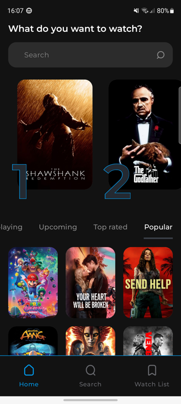
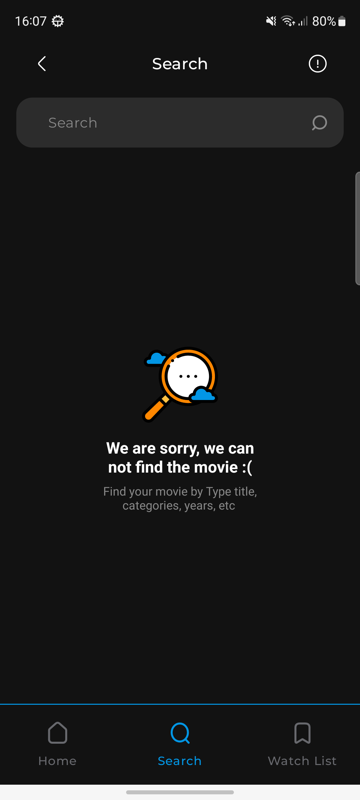
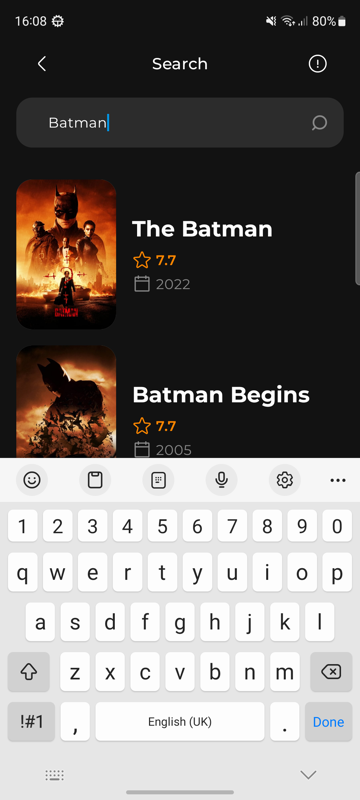
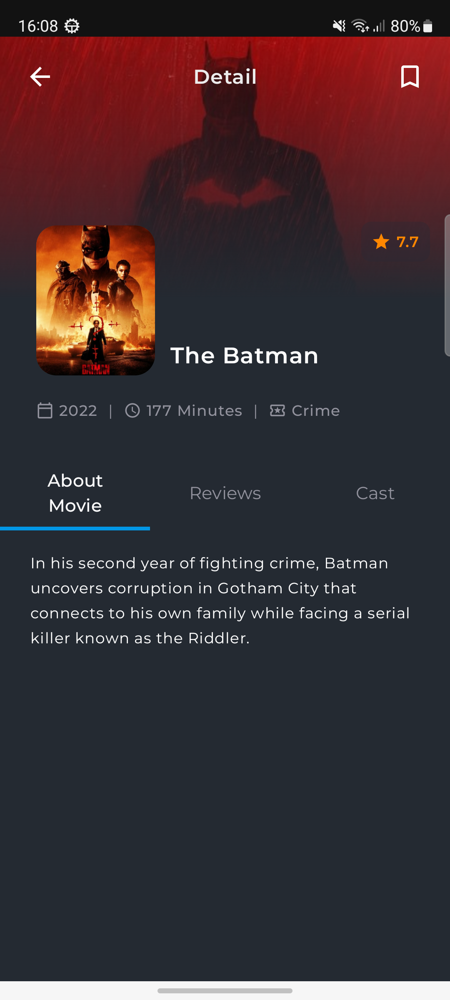
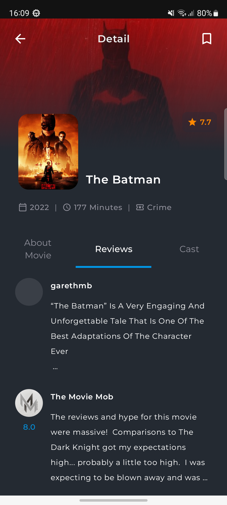
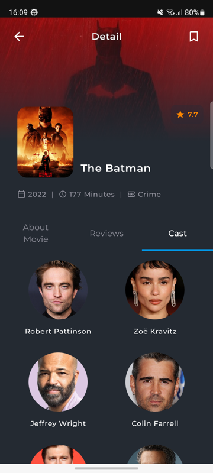
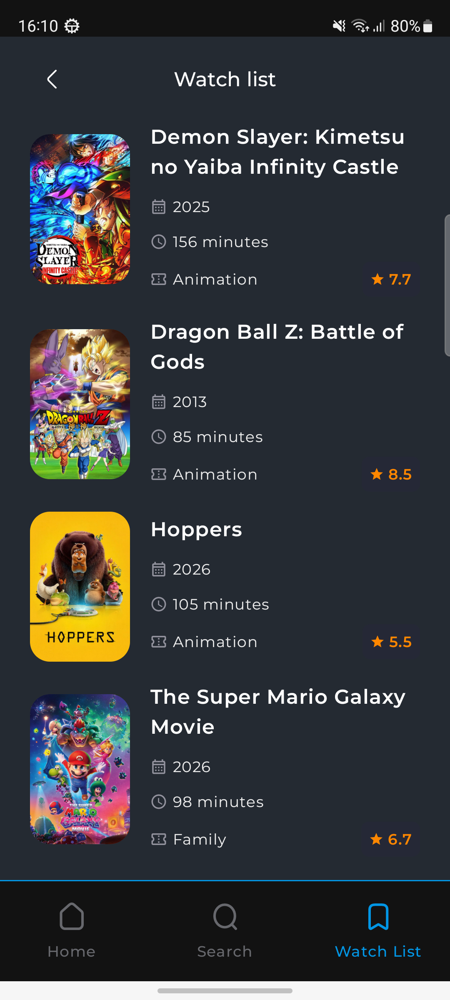

# TheMovies

An Android movie browser app built with Jetpack Compose, powered by the [TMDB API](https://www.themoviedb.org/documentation/api).

## Screenshots

<p align="center">
  
  
  
  
  
  
  
</p>

## Features

- **Home** — trending and popular movies in a scrollable feed
- **Search** — real-time search with pagination
- **Detail** — backdrop image, movie poster, About/Reviews/Cast tabs, user rating modal
- **Watchlist** — Room-persisted watchlist with user ratings, empty state

## Tech Stack

| Layer | Technology |
|---|---|
| UI | Jetpack Compose + Material3 |
| Architecture | Clean Architecture + MVVM |
| DI | Hilt |
| Network | Retrofit + OkHttp + Moshi |
| Persistence | Room |
| Images | Coil |
| Async | Kotlin Coroutines + Flow |
| Navigation | Compose NavHost |

## Architecture

```
feature:* → core:domain ← core:data → core:network
               ↑                           ↑
            core:ui                   core:database
```

- **`core:domain`** — pure Kotlin models, repository interfaces, use cases
- **`core:data`** — repository implementations, network→domain mapping
- **`core:network`** — Retrofit + Moshi, TMDB API client
- **`core:database`** — Room entities, DAOs, Hilt module
- **`core:ui`** — shared Compose components and theme
- **`feature:home`** — home screen ViewModel + UI
- **`feature:search`** — search screen ViewModel + UI
- **`feature:detailmovie`** — detail screen ViewModel + UI
- **`feature:watchlist`** — watchlist screen ViewModel + UI

## Getting Started

### Prerequisites

- Android Studio Hedgehog or later
- JDK 17+
- A free [TMDB API key](https://www.themoviedb.org/settings/api)

### Setup

1. Clone the repo:
   ```bash
   git clone https://github.com/congdanh2504/TheMovies.git
   ```

2. Add your TMDB API key to `local.properties` (create the file if it doesn't exist):
   ```properties
   TMDB_API_KEY=your_api_key_here
   ```

3. Build and run:
   ```bash
   ./gradlew assembleDebug
   ```

## Build Commands

```bash
./gradlew assembleDebug          # Build debug APK
./gradlew assembleRelease        # Build release APK
./gradlew test                   # Run unit tests
./gradlew lint                   # Run lint checks
./gradlew clean                  # Clean build directories
```

## Module Convention Plugins

Gradle is configured via convention plugins in `build-logic/convention`:

```kotlin
plugins {
    alias(libs.plugins.themovies.android.library)   // base Android library
    alias(libs.plugins.themovies.android.compose)   // Compose + BOM
    alias(libs.plugins.themovies.android.hilt)      // Hilt + KSP
    alias(libs.plugins.themovies.android.room)      // Room + KSP
}
```

All versions are managed through `gradle/libs.versions.toml`.
